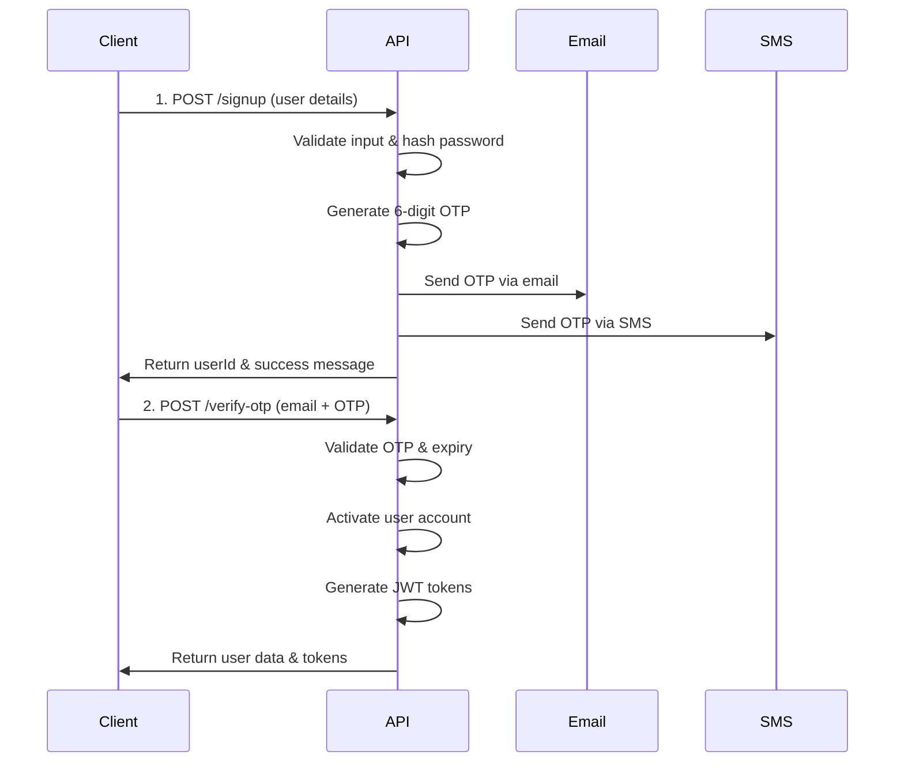

# Imagomum API - Signup & OTP Documentation

## 📋 Overview

The Imagomum signup process uses a secure two-step verification system with 6-digit OTP codes sent to both email and phone number.

## 🔐 Authentication Flow



## 🚀 API Endpoints

### 1. User Signup

**Endpoint:** `POST /api/v1/auth/signup`

Creates a new user account and sends OTP for verification.

#### Request Body

```json
{
  "fullName": "Warith Yellow",
  "email": "yellow@gmail.com", 
  "phoneNumber": "909038303993",
  "password": "SecurePass123!",
  "confirmPassword": "SecurePass123!"
}
```

#### Field Validation

| Field | Type | Rules | Example |
|-------|------|-------|---------|
| `fullName` | string | 2-100 chars, letters & spaces only | "Warith Yellow" |
| `email` | string | Valid email format | "yellow@gmail.com" |
| `phoneNumber` | string | 10-15 digits, valid mobile format | "909038303993" |
| `password` | string | Min 8 chars, must include uppercase, lowercase, number, special char | "SecurePass123!" |
| `confirmPassword` | string | Must match password exactly | "SecurePass123!" |

#### Success Response (201)

```json
{
  "status": "success",
  "message": "Signup successful. OTP sent to your email and phone.",
  "data": {
    "userId": "123e4567-e89b-12d3-a456-426614174000",
    "email": "yellow@gmail.com",
    "phoneNumber": "909038303993",
    "otpSent": true,
    "otpExpiresAt": "2024-01-15T10:15:00Z"
  }
}
```

#### Error Responses

**Validation Error (400)**
```json
{
  "status": "fail",
  "message": "Validation failed",
  "errors": [
    {
      "field": "email",
      "message": "Please provide a valid email address"
    },
    {
      "field": "password", 
      "message": "Password must contain at least one uppercase letter"
    }
  ]
}
```

**User Exists (409)**
```json
{
  "status": "fail",
  "message": "User with this email already exists"
}
```

### 2. Verify OTP

**Endpoint:** `POST /api/v1/auth/verify-otp`

Verifies the 6-digit OTP and activates the user account.

#### Request Body

```json
{
  "email": "yellow@gmail.com",
  "otp": "123456"
}
```

#### Success Response (200)

```json
{
  "status": "success",
  "message": "Account verified successfully",
  "data": {
    "user": {
      "id": "123e4567-e89b-12d3-a456-426614174000",
      "fullName": "Warith Yellow",
      "email": "yellow@gmail.com",
      "phoneNumber": "909038303993",
      "isVerified": true
    },
    "tokens": {
      "accessToken": "eyJhbGciOiJIUzI1NiIsInR5cCI6IkpXVCJ9...",
      "refreshToken": "eyJhbGciOiJIUzI1NiIsInR5cCI6IkpXVCJ9...",
      "expiresIn": "24h"
    }
  }
}
```

#### Error Responses

**Invalid OTP (401)**
```json
{
  "status": "fail",
  "message": "Invalid OTP"
}
```

**Expired OTP (401)**
```json
{
  "status": "fail",
  "message": "OTP has expired"
}
```

**User Not Found (404)**
```json
{
  "status": "fail", 
  "message": "User not found"
}
```

### 3. Resend OTP

**Endpoint:** `POST /api/v1/auth/resend-otp`

Generates and sends a new OTP to the user.

#### Request Body

```json
{
  "email": "yellow@gmail.com"
}
```

#### Success Response (200)

```json
{
  "status": "success",
  "message": "New OTP sent to your email and phone",
  "data": {
    "email": "yellow@gmail.com",
    "phoneNumber": "909038303993", 
    "otpExpiresAt": "2024-01-15T10:25:00Z"
  }
}
```

## 🔒 Security Features

### OTP Security
- **6-digit numeric code** (100000-999999)
- **10-minute expiry** from generation time
- **Single-use only** - becomes invalid after successful verification
- **Sent to both email and SMS** for dual verification

### Password Security
- **Minimum 8 characters**
- **Must contain:**
  - At least 1 uppercase letter (A-Z)
  - At least 1 lowercase letter (a-z)  
  - At least 1 number (0-9)
  - At least 1 special character (@$!%*?&)
- **Hashed with bcrypt** (12 salt rounds)

### Account Security
- **Email uniqueness** - No duplicate emails allowed
- **Phone uniqueness** - No duplicate phone numbers allowed
- **Account activation** - Users must verify OTP before accessing features
- **JWT tokens** - Secure authentication after verification

## 📱 Integration Examples

### Frontend Integration (JavaScript)

```javascript
// 1. Signup User
const signup = async (userData) => {
  try {
    const response = await fetch('/api/v1/auth/signup', {
      method: 'POST',
      headers: {
        'Content-Type': 'application/json',
      },
      body: JSON.stringify(userData)
    });
    
    const result = await response.json();
    
    if (result.status === 'success') {
      // Show OTP input screen
      showOTPScreen(result.data.email);
    } else {
      // Handle validation errors
      showErrors(result.errors);
    }
  } catch (error) {
    console.error('Signup failed:', error);
  }
};

// 2. Verify OTP
const verifyOTP = async (email, otp) => {
  try {
    const response = await fetch('/api/v1/auth/verify-otp', {
      method: 'POST',
      headers: {
        'Content-Type': 'application/json',
      },
      body: JSON.stringify({ email, otp })
    });
    
    const result = await response.json();
    
    if (result.status === 'success') {
      // Store tokens and redirect to app
      localStorage.setItem('accessToken', result.data.tokens.accessToken);
      localStorage.setItem('refreshToken', result.data.tokens.refreshToken);
      window.location.href = '/dashboard';
    } else {
      // Show OTP error
      showOTPError(result.message);
    }
  } catch (error) {
    console.error('OTP verification failed:', error);
  }
};

// 3. Resend OTP
const resendOTP = async (email) => {
  try {
    const response = await fetch('/api/v1/auth/resend-otp', {
      method: 'POST',
      headers: {
        'Content-Type': 'application/json',
      },
      body: JSON.stringify({ email })
    });
    
    const result = await response.json();
    showMessage('New OTP sent to your email and phone');
  } catch (error) {
    console.error('Resend OTP failed:', error);
  }
};
```

### React Integration Example

```jsx
import React, { useState } from 'react';

const SignupFlow = () => {
  const [step, setStep] = useState('signup'); // 'signup' or 'verify'
  const [email, setEmail] = useState('');
  const [errors, setErrors] = useState([]);

  const handleSignup = async (formData) => {
    try {
      const response = await fetch('/api/v1/auth/signup', {
        method: 'POST',
        headers: { 'Content-Type': 'application/json' },
        body: JSON.stringify(formData)
      });
      
      const result = await response.json();
      
      if (result.status === 'success') {
        setEmail(formData.email);
        setStep('verify');
      } else {
        setErrors(result.errors || []);
      }
    } catch (error) {
      console.error('Signup failed:', error);
    }
  };

  const handleVerifyOTP = async (otp) => {
    try {
      const response = await fetch('/api/v1/auth/verify-otp', {
        method: 'POST',
        headers: { 'Content-Type': 'application/json' },
        body: JSON.stringify({ email, otp })
      });
      
      const result = await response.json();
      
      if (result.status === 'success') {
        // Store tokens and redirect
        localStorage.setItem('accessToken', result.data.tokens.accessToken);
        window.location.href = '/dashboard';
      }
    } catch (error) {
      console.error('OTP verification failed:', error);
    }
  };

  return (
    <div>
      {step === 'signup' && <SignupForm onSubmit={handleSignup} errors={errors} />}
      {step === 'verify' && <OTPForm email={email} onVerify={handleVerifyOTP} />}
    </div>
  );
};
```

## 🧪 Testing

### cURL Examples

**1. Signup**
```bash
curl -X POST http://localhost:3000/api/v1/auth/signup \
  -H "Content-Type: application/json" \
  -d '{
    "fullName": "Warith Yellow",
    "email": "yellow@gmail.com",
    "phoneNumber": "909038303993", 
    "password": "SecurePass123!",
    "confirmPassword": "SecurePass123!"
  }'
```

**2. Verify OTP**
```bash
curl -X POST http://localhost:3000/api/v1/auth/verify-otp \
  -H "Content-Type: application/json" \
  -d '{
    "email": "yellow@gmail.com",
    "otp": "123456"
  }'
```

**3. Resend OTP**
```bash
curl -X POST http://localhost:3000/api/v1/auth/resend-otp \
  -H "Content-Type: application/json" \
  -d '{
    "email": "yellow@gmail.com"
  }'
```

## 🔍 Monitoring & Logging

### Events Logged
- `USER_SIGNUP_INITIATED` - When user submits signup form
- `USER_ACCOUNT_VERIFIED` - When OTP verification succeeds
- `OTP_RESEND` - When user requests new OTP
- `INVALID_OTP_ATTEMPT` - Security event for wrong OTP
- `INVALID_LOGIN_ATTEMPT` - Security event for failed login

### Health Check
```bash
curl http://localhost:3000/health
```

## 🔗 Next Steps

After successful OTP verification:
1. User receives JWT tokens for authentication
2. Redirect to onboarding flow
3. Complete profile setup
4. Access to ultrasound upload features

## 📞 Support

For API questions or integration support, contact the Imagomum development team.

---

**🏥 Built for maternal healthcare excellence** 