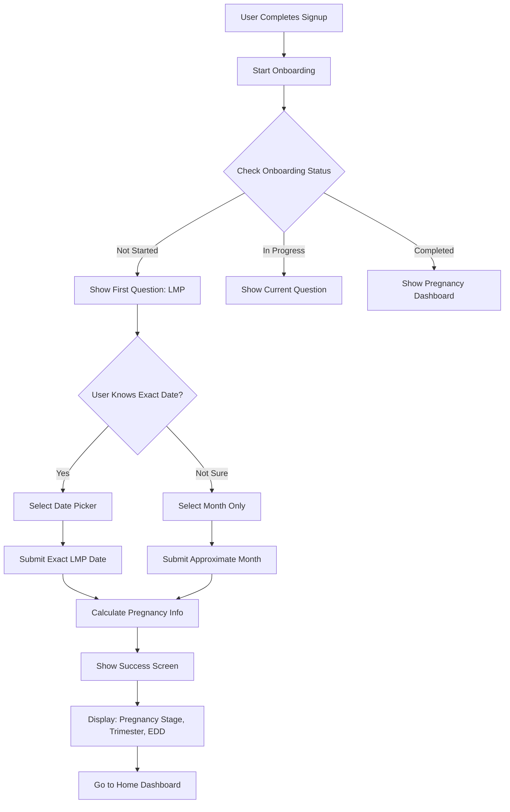

# Imagomum Onboarding API Documentation

## 📋 Overview

The Imagomum onboarding system personalizes pregnancy care by collecting Last Menstrual Period (LMP) information and calculating pregnancy details including gestational age, trimester, and estimated due date.

## 🎯 **Key Features**

- **Scalable Question System** - Easy to add new onboarding questions
- **Pregnancy Calculations** - Automatic EDD, trimester, and gestational age calculation
- **Flexible LMP Input** - Exact date or approximate month selection
- **Progress Tracking** - Step-by-step onboarding progress
- **Mobile-First Design** - Optimized for mobile app integration

## 📱 **User Flow**



## 🔐 **Authentication**

All onboarding endpoints require authentication. Include the JWT token from signup/login:

```bash
Authorization: Bearer <access_token>
```

## 🚀 **API Endpoints**

### 1. Get Onboarding Status

**Endpoint:** `GET /api/v1/onboarding/status`

Returns current onboarding progress and next question.

#### Success Response (200)

```json
{
  "status": "success",
  "data": {
    "isCompleted": false,
    "currentStep": 0,
    "totalSteps": 1,
    "currentQuestion": {
      "id": "lmp_date",
      "type": "pregnancy_lmp",
      "title": "Let's personalize your pregnancy care.",
      "question": "When was your last period?",
      "required": true,
      "alternativeOptions": [
        {
          "id": "approximate_month",
          "text": "Not sure?",
          "type": "month_selector"
        }
      ]
    },
    "answers": {},
    "pregnancyInfo": null
  }
}
```

### 2. Submit Onboarding Answer

**Endpoint:** `POST /api/v1/onboarding/submit`

Submit answers for onboarding questions.

#### **For Exact LMP Date**

```json
{
  "questionId": "lmp_date",
  "answerType": "exact_date",
  "answer": "2024-06-26"
}
```

#### **For Approximate Month**

```json
{
  "questionId": "lmp_date", 
  "answerType": "approximate_month",
  "answer": {
    "month": 6,
    "year": 2024
  }
}
```

#### Success Response (200)

```json
{
  "status": "success",
  "message": "Onboarding completed successfully!",
  "data": {
    "isCompleted": true,
    "currentStep": 1,
    "totalSteps": 1,
    "nextQuestion": null,
    "pregnancyInfo": {
      "edd": "2025-04-02",
      "eddFormatted": "April 02, 2025",
      "gestationalAge": "7 weeks",
      "gestationalWeeks": 7,
      "gestationalDays": 0,
      "trimester": "1st Trimester",
      "daysPregnant": 49,
      "lmpDate": "2024-06-26",
      "calculatedAt": "2025-01-28 19:30:15"
    }
  }
}
```

### 3. Get Onboarding Configuration

**Endpoint:** `GET /api/v1/onboarding/config`

Returns onboarding questions configuration for frontend.

#### Success Response (200)

```json
{
  "status": "success",
  "data": {
    "version": "1.0",
    "totalSteps": 1,
    "questions": [
      {
        "id": "lmp_date",
        "type": "pregnancy_lmp",
        "title": "Let's personalize your pregnancy care.",
        "question": "When was your last period?",
        "required": true,
        "validation": {
          "dateFormat": "YYYY-MM-DD",
          "maxDate": "today",
          "minDate": "1 year ago"
        },
        "alternativeOptions": [
          {
            "id": "approximate_month",
            "text": "Not sure?",
            "type": "month_selector"
          }
        ]
      }
    ]
  }
}
```

### 4. Restart Onboarding

**Endpoint:** `POST /api/v1/onboarding/restart`

Resets onboarding progress to the beginning.

#### Success Response (200)

```json
{
  "status": "success",
  "message": "Onboarding restarted successfully",
  "data": {
    "isCompleted": false,
    "currentStep": 0,
    "totalSteps": 1,
    "currentQuestion": {
      "id": "lmp_date",
      "type": "pregnancy_lmp",
      "title": "Let's personalize your pregnancy care.",
      "question": "When was your last period?"
    }
  }
}
```

### 5. Skip Onboarding

**Endpoint:** `POST /api/v1/onboarding/skip`

Allows users to skip onboarding (for future use).

#### Success Response (200)

```json
{
  "status": "success",
  "message": "Onboarding skipped successfully",
  "data": {
    "isCompleted": true,
    "isSkipped": true
  }
}
```

## 🤰 **Pregnancy Calculations**

### **Formula Used**
Based on standard obstetric calculations:

- **EDD (Estimated Due Date)** = LMP + 280 days
- **Gestational Age** = Days since LMP ÷ 7 weeks
- **Trimester Determination:**
  - 1st Trimester: 0-13 weeks
  - 2nd Trimester: 14-27 weeks  
  - 3rd Trimester: 28+ weeks

### **Pregnancy Info Object**

```json
{
  "edd": "2025-04-02",
  "eddFormatted": "April 02, 2025",
  "gestationalAge": "7 weeks",
  "gestationalWeeks": 7,
  "gestationalDays": 0,
  "trimester": "1st Trimester",
  "daysPregnant": 49,
  "lmpDate": "2024-06-26",
  "calculatedAt": "2025-01-28 19:30:15",
  "isApproximate": false
}
```

### **For Approximate Month Selection**

When user selects only month/year, the system:
1. Uses 15th of the month as estimated LMP
2. Marks calculation as approximate
3. Includes original input for reference

```json
{
  "edd": "2025-04-15",
  "eddFormatted": "April 15, 2025", 
  "gestationalAge": "6 weeks, 5 days",
  "gestationalWeeks": 6,
  "gestationalDays": 5,
  "trimester": "1st Trimester",
  "isApproximate": true,
  "approximationMethod": "month",
  "originalInput": {
    "month": 6,
    "year": 2024
  }
}
```

## 📱 **Mobile App Integration**

### **React Native Example**

```javascript
import React, { useState, useEffect } from 'react';

const OnboardingFlow = ({ accessToken }) => {
  const [onboardingData, setOnboardingData] = useState(null);
  const [selectedDate, setSelectedDate] = useState(null);

  useEffect(() => {
    fetchOnboardingStatus();
  }, []);

  const fetchOnboardingStatus = async () => {
    try {
      const response = await fetch('/api/v1/onboarding/status', {
        headers: {
          'Authorization': `Bearer ${accessToken}`,
          'Content-Type': 'application/json'
        }
      });
      
      const result = await response.json();
      setOnboardingData(result.data);
    } catch (error) {
      console.error('Failed to fetch onboarding status:', error);
    }
  };

  const submitLMPDate = async (date) => {
    try {
      const response = await fetch('/api/v1/onboarding/submit', {
        method: 'POST',
        headers: {
          'Authorization': `Bearer ${accessToken}`,
          'Content-Type': 'application/json'
        },
        body: JSON.stringify({
          questionId: 'lmp_date',
          answerType: 'exact_date',
          answer: date
        })
      });
      
      const result = await response.json();
      
      if (result.status === 'success') {
        // Show success screen with pregnancy info
        showSuccessScreen(result.data.pregnancyInfo);
      }
    } catch (error) {
      console.error('Failed to submit LMP date:', error);
    }
  };

  const submitApproximateMonth = async (month, year) => {
    try {
      const response = await fetch('/api/v1/onboarding/submit', {
        method: 'POST',
        headers: {
          'Authorization': `Bearer ${accessToken}`,
          'Content-Type': 'application/json'
        },
        body: JSON.stringify({
          questionId: 'lmp_date',
          answerType: 'approximate_month',
          answer: { month, year }
        })
      });
      
      const result = await response.json();
      
      if (result.status === 'success') {
        showSuccessScreen(result.data.pregnancyInfo);
      }
    } catch (error) {
      console.error('Failed to submit approximate month:', error);
    }
  };

  // Render onboarding UI based on current step
  if (!onboardingData) return <LoadingScreen />;
  
  if (onboardingData.isCompleted) {
    return <PregnancyDashboard pregnancyInfo={onboardingData.pregnancyInfo} />;
  }

  return (
    <OnboardingQuestion
      question={onboardingData.currentQuestion}
      onSubmitDate={submitLMPDate}
      onSubmitMonth={submitApproximateMonth}
    />
  );
};
```

### **Frontend Validation**

```javascript
const validateLMPDate = (dateString) => {
  const date = new Date(dateString);
  const today = new Date();
  const oneYearAgo = new Date();
  oneYearAgo.setFullYear(oneYearAgo.getFullYear() - 1);

  if (isNaN(date.getTime())) {
    return { valid: false, error: 'Invalid date format' };
  }

  if (date > today) {
    return { valid: false, error: 'Date cannot be in the future' };
  }

  if (date < oneYearAgo) {
    return { valid: false, error: 'Date cannot be more than 1 year ago' };
  }

  return { valid: true };
};
```

## 🧪 **Testing**

### **Test the Complete Flow**

```bash
# 1. Get onboarding status
curl -X GET http://localhost:3000/api/v1/onboarding/status \
  -H "Authorization: Bearer <access_token>"

# 2. Submit exact LMP date
curl -X POST http://localhost:3000/api/v1/onboarding/submit \
  -H "Authorization: Bearer <access_token>" \
  -H "Content-Type: application/json" \
  -d '{
    "questionId": "lmp_date",
    "answerType": "exact_date",
    "answer": "2024-06-26"
  }'

# 3. Check user profile (includes pregnancy info)
curl -X GET http://localhost:3000/api/v1/users/profile \
  -H "Authorization: Bearer <access_token>"
```

### **Test Approximate Month**

```bash
curl -X POST http://localhost:3000/api/v1/onboarding/submit \
  -H "Authorization: Bearer <access_token>" \
  -H "Content-Type: application/json" \
  -d '{
    "questionId": "lmp_date",
    "answerType": "approximate_month",
    "answer": {
      "month": 6,
      "year": 2024
    }
  }'
```

## 🔄 **User Profile Integration**

After onboarding completion, user profile includes:

```json
{
  "user": {
    "id": "user-id",
    "fullName": "Chioma Example",
    "email": "chioma@example.com",
    "onboarding": {
      "isCompleted": true,
      "currentStep": 1,
      "completedAt": "2025-01-28T19:30:15Z"
    },
    "pregnancyInfo": {
      "edd": "2025-04-02",
      "eddFormatted": "April 02, 2025",
      "gestationalAge": "7 weeks",
      "trimester": "1st Trimester"
    }
  }
}
```

## 🔧 **Extending the Onboarding System**

### **Adding New Questions**

The system is designed to be scalable. To add new questions:

1. **Update the configuration** in `onboardingController.js`:

```javascript
const ONBOARDING_QUESTIONS = {
  version: '1.0',
  questions: [
    {
      id: 'lmp_date',
      type: 'pregnancy_lmp',
      // ... existing LMP question
    },
    {
      id: 'medical_history',
      type: 'multiple_choice',
      title: 'Medical Information',
      question: 'Do you have any medical conditions?',
      required: false,
      options: [
        { id: 'none', text: 'None' },
        { id: 'diabetes', text: 'Diabetes' },
        { id: 'hypertension', text: 'High Blood Pressure' },
        { id: 'other', text: 'Other' }
      ]
    }
  ]
};
```

2. **Handle the new question type** in the submit function
3. **Update frontend** to render the new question type
4. **Add validation** for the new answer format

## 📊 **Analytics & Logging**

The system logs key events:

- `USER_ONBOARDING_COMPLETED` - When user finishes onboarding
- `USER_ONBOARDING_SKIPPED` - When user skips onboarding
- `USER_ONBOARDING_RESTARTED` - When user restarts onboarding

## 🔒 **Data Privacy**

- Pregnancy information is sensitive medical data
- All calculations are done server-side
- Logs exclude sensitive medical details in production
- User can restart onboarding to update pregnancy info

## 🌟 **Success Screen Data**

The mobile app shows this information after successful onboarding:

- **Pregnancy Stage**: "7 weeks"
- **Current Trimester**: "1st Trimester"  
- **Expected Due Date**: "January 08, 2026"

This matches the exact format shown in your mobile app screens! 🚀

---

**🏥 Ready to personalize pregnancy care for every mother!** 